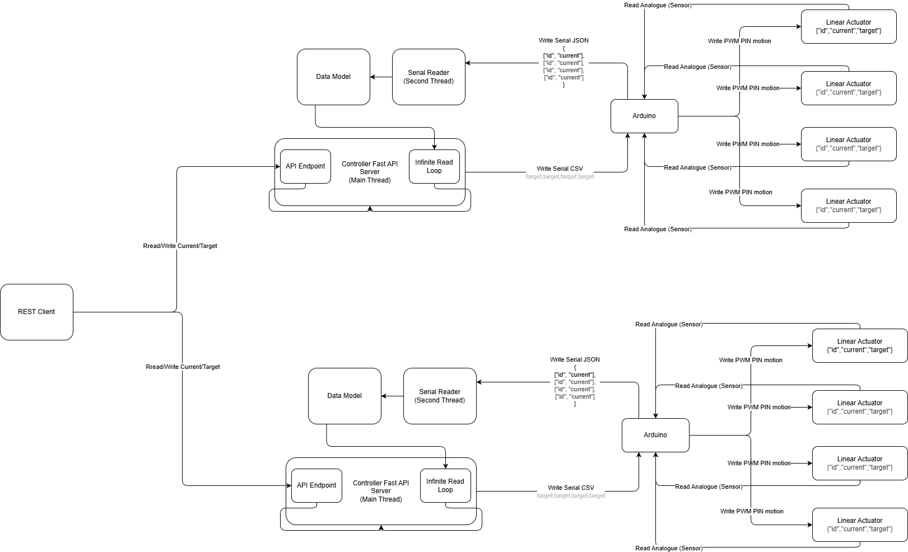

# Linear Actuator Control Notes

This folder contains an Arduino + Python workflow for controlling a linear actuator with an IBT-2 H-bridge and a draw-wire potentiometer sensor.

## What is here

- Main Arduino control loop.
- Python controller to send target values over serial.
- Wiring and reference images (to be updated)

## Current control behavior



- Valid target range: `0..1023`.
- Initial target at boot: `50`.
- Deadband around target: `10` ADC counts.
- Drive power: `DRIVE_PWM = 70`.
- Sampling interval: `100 ms`.
- Filtering: 7-sample median (`MEDIAN_SAMPLES = 7`) to reduce noise.

## Serial protocol

1. Install the `https://github.com/arduino-libraries/Arduino_JSON` library.
   1.1 The package is available via the Arduino IDE Package manager.
2. Verify and upload code to Arduino Mega as usual.

## How to run python linear actuator controller

1. Open and upload `linear_actuator\linear_act_dc_potentiometer\linear_act_dc_potentiometer.ino` to the Arduino.
2. Activate/create python virtual environment `venv`
3. Install Python dependencies:
   3.1 `pip install -r ./venv_requirements.txt`
4. Run the controller script (replace COM port depending on the arduino IDE detected port):
   4.1 `python linear_actuator\controller_py\main.py --port COM5`
5. From a REST http client (Ex. [Postman](https://www.postman.com/) or custom component) send GET/POST requests to the `{server_url}/actuators`
   5.1 GET: (no body) -> returns current status of the controller and linear actuators
   5.2 POST: (JSON body) -> sets linear actuator new targets

      ``` JSON
      {
          "a1_target": 30.0,
          "a2_target": 50.0,
          "a3_target": 90.0,
          "a4_target": 120.0
      }
      ```
