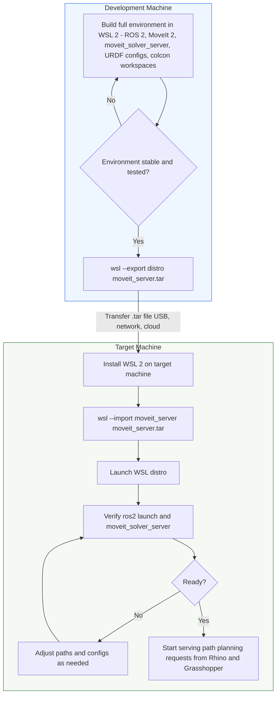

# Deploying the ROS2 / MoveIt Environment via WSL2

## Overview

Setting up ROS 2, MoveIt 2, and the `moveit_solver_server` from scratch takes significant time — package installation, workspace builds, and configuration tuning all have to be repeated on every new machine.

Instead, we build the full environment once on a development WSL2 distribution, **export** it as a portable `.tar` image, and **import** that image on any target computer. The result is a ready-to-run WSL2 instance with everything pre-installed.

## Workflow



## Exporting a WSL2 Distribution

On the **development machine** where the environment is fully built:

```powershell
# 1. List installed WSL distributions to find the exact name
wsl --list --verbose

# Example output:
#   NAME            STATE      VERSION
# * Ubuntu-22.04    Running    2
#   moveit_dev      Running    2

# 2. Shut down the distribution cleanly before exporting
wsl --terminate moveit_dev

# 3. Export the entire distribution to a .tar file
wsl --export moveit_dev D:\exports\moveit_server.tar
```

> **Note:** The resulting `.tar` can be several GB depending on installed packages. Plan your transfer accordingly (USB drive, shared network folder, or cloud storage).

## Transferring the Image

| Method                                 | Best for                        | Typical speed                        |
| -------------------------------------- | ------------------------------- | ------------------------------------ |
| USB 3.x external drive                 | Air-gapped machines, no network | ~100–400 MB/s                        |
| SMB / network share                    | Same LAN, both machines online  | ~50–120 MB/s                         |
| Cloud storage (OneDrive, Google Drive) | Remote machines, async workflow | Depends on upload/download bandwidth |

## Importing on the Target Machine

On the **target machine** that will host the ROS server:

```powershell
# 1. Make sure WSL 2 is installed
wsl --install

# 2. (Optional) Create a dedicated directory for the VM disk
mkdir C:\WSL\moveit_server

# 3. Import the .tar into a new WSL distribution
wsl --import moveit_server C:\WSL\moveit_server D:\path\to\moveit_server.tar

# 4. Launch the imported distribution
wsl --distribution moveit_server

# 5. (Optional) Set the default user if needed
#    By default, imported distros use root. To switch:
ubuntu2204.exe config --default-user <your_username>
```

### Verifying the Import

Inside the imported WSL2 distribution:

```bash
# Check that ROS 2 is available
source /opt/ros/humble/setup.bash
ros2 --help

# Check that MoveIt 2 workspace is present
source ~/ws_moveit2/install/setup.bash
ros2 pkg list | grep moveit

# Check that the solver server package exists
colcon build --packages-select moveit_solver_server 2>&1 | head -5
# Should print "Starting >>> moveit_solver_server" (or "Finished" if already built)
```

## Updating an Existing Import

If you need to refresh the image with newer code or packages on the development machine:

```powershell
# 1. Make changes in the WSL distribution
wsl --distribution moveit_dev
# ... edit code, rebuild with colcon, test ...

# 2. Re-export
wsl --terminate moveit_dev
wsl --export moveit_dev D:\exports\moveit_server_v2.tar

# 3. On the target machine, remove the old import and re-import
wsl --terminate moveit_server
wsl --unregister moveit_server
wsl --import moveit_server C:\WSL\moveit_server D:\exports\moveit_server_v2.tar
```

> **Limitation:** WSL2 export/import is a full snapshot — there is no incremental diff. Every update produces a new `.tar` of the same size.

## Starting the Server After Import

Once imported, the startup procedure is identical to the normal workflow:

```bash
# Inside the imported WSL distro — Terminal A: MoveIt
export ROBOTNAME=my_robot_name
export WORKSPACE_ROOT=~/repos/my_robot/ws_robot
cd "$WORKSPACE_ROOT"
source /opt/ros/humble/setup.bash
source ~/ws_moveit2/install/setup.bash
ros2 launch ${ROBOTNAME}_config demo.launch.py

# Terminal B: solver server
source ./venv/bin/activate
source /opt/ros/humble/setup.bash
source ~/ws_moveit2/install/setup.bash
source ./install/setup.bash
ros2 run moveit_solver_server server
```

Rhino / Grasshopper can then reach the server at `localhost:7500` (see [WSL Networking](wsl.md) for port forwarding details).
