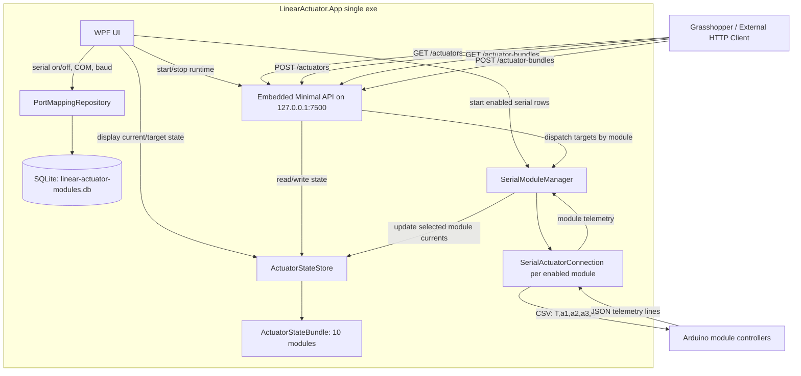
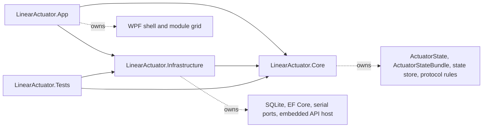
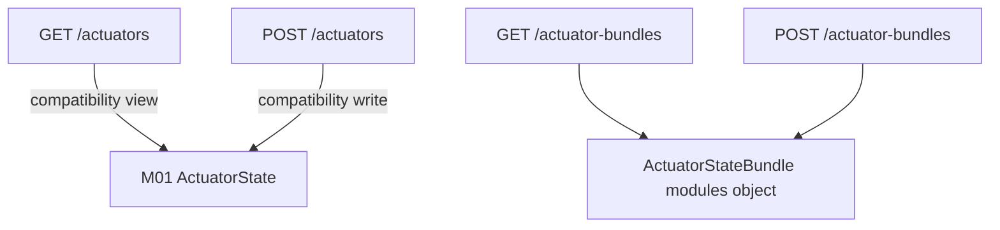
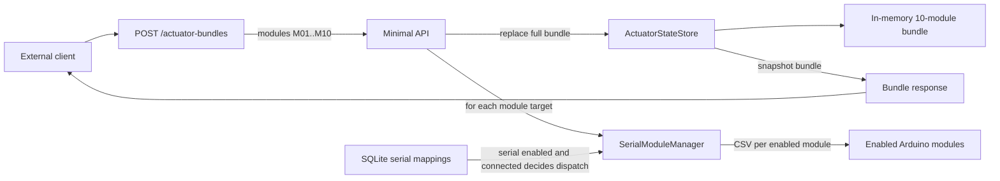
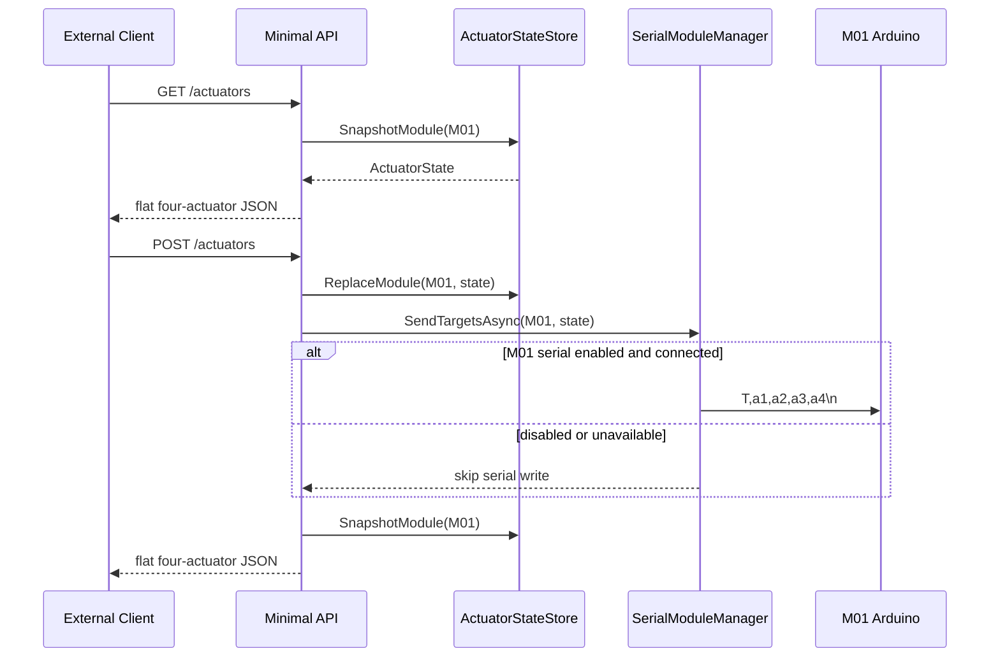
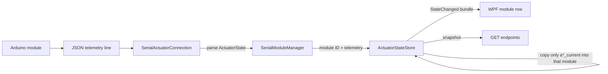
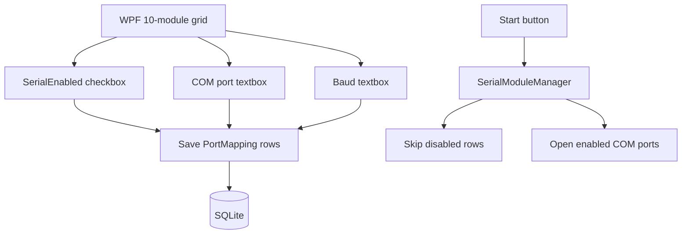
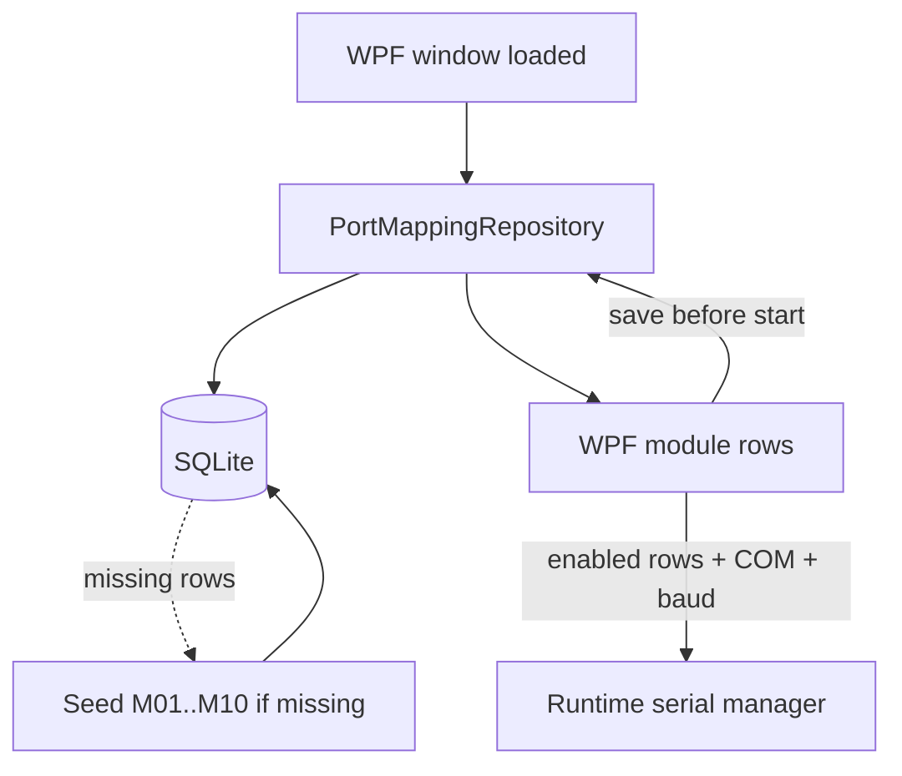

# Linear Actuator System Diagram

The rewrite is a single Windows WPF executable. It hosts the local WebAPI, SQLite serial-port configuration, in-memory state for 10 actuator modules, and optional serial connections to Arduino controllers.

Each module is one Arduino-controlled group of four actuators. Module IDs are `M01` through `M10`.

## Component View



## Project Boundaries



## API Shape



Bundle JSON shape:

```json
{
  "modules": {
    "M01": { "a1_current": null, "a1_target": 50, "a2_current": null, "a2_target": 50, "a3_current": null, "a3_target": 50, "a4_current": null, "a4_target": 50 },
    "M02": { "a1_current": null, "a1_target": 50, "a2_current": null, "a2_target": 50, "a3_current": null, "a3_target": 50, "a4_current": null, "a4_target": 50 }
  }
}
```

## Bundle Target Dataflow



## Single-Module Compatibility Dataflow



## Serial Telemetry Dataflow



## Serial Toggle Dataflow



## Persistence Dataflow



## Compatibility Rules

- Fixed local API endpoint: `http://127.0.0.1:7500`.
- `GET /actuators` and `POST /actuators` remain the flat four-actuator M01 compatibility API.
- `GET /actuator-bundles` and `POST /actuator-bundles` handle all 10 modules in one payload.
- Each serial command remains CSV: `T,a1,a2,a3,a4\n`.
- Target range remains `0..800`.
- Serial dispatch is controlled by the WPF/SQLite module toggles.
- Disabled or unavailable serial ports do not block API state updates.
- Telemetry updates only `*_current` fields for the source module; targets remain server-authoritative.
