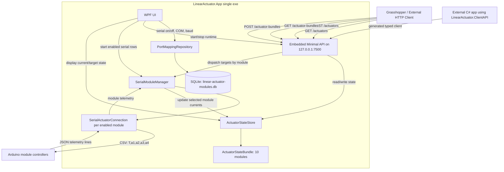
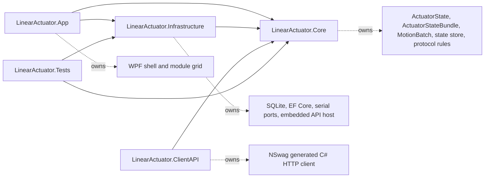
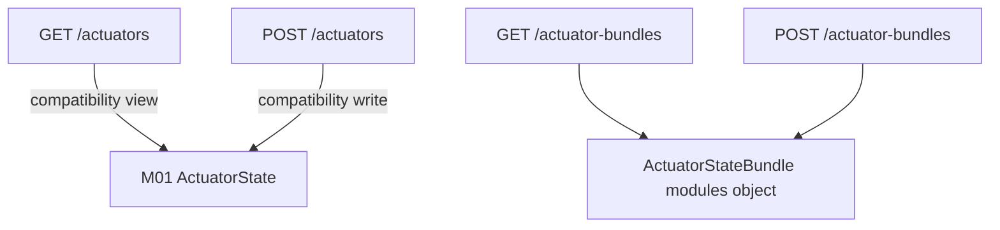
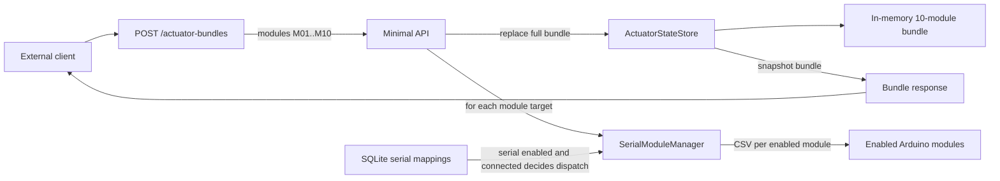
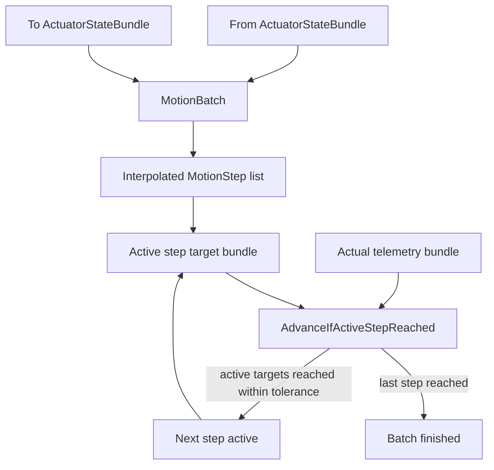
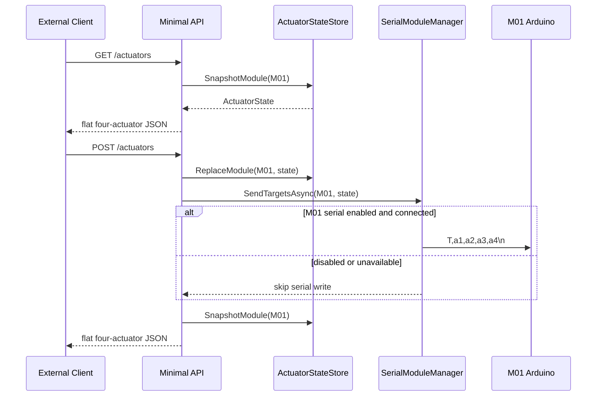
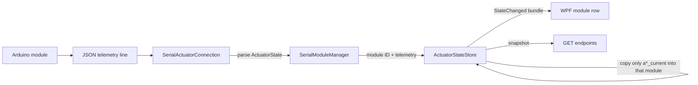
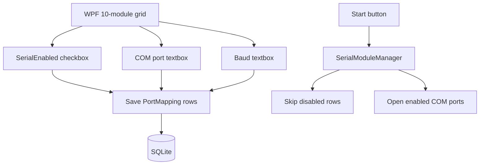
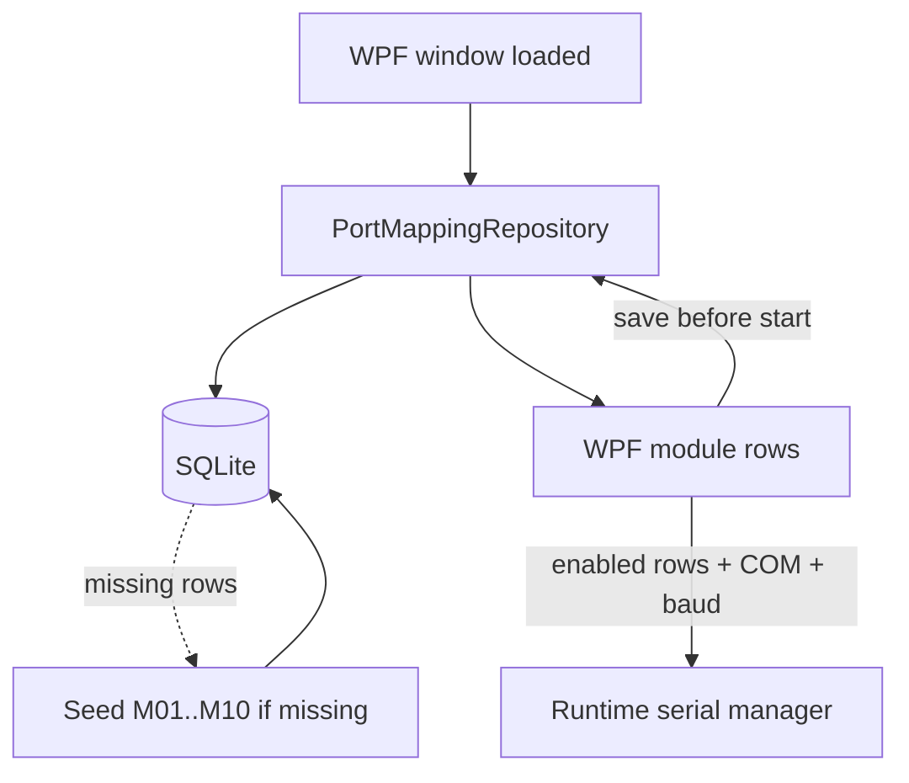

# Linear Actuator System Diagram

The rewrite is a single Windows WPF executable. It hosts the local WebAPI, SQLite serial-port configuration, in-memory state for 10 actuator modules, and optional serial connections to Arduino controllers.

Current development state: the API, WPF module grid, SQLite serial mapping, generated C# client, serial command formatting, telemetry ingestion, and MotionBatch step planner are implemented and covered by tests. MotionBatch is not yet wired into the API or serial dispatch loop, so posted target bundles still send their final target values directly to enabled Arduino modules.

Each module is one Arduino-controlled group of four actuators. Module IDs are `M01` through `M10`.

## Component View



## Project Boundaries



## API Shape



Bundle JSON shape:

```json
{
  "modules": {
    "M01": { "a1_current": null, "a1_target": 50, "a2_current": null, "a2_target": 50, "a3_current": null, "a3_target": 50, "a4_current": null, "a4_target": 50 },
    "M02": { "a1_current": null, "a1_target": 50, "a2_current": null, "a2_target": 50, "a3_current": null, "a3_target": 50, "a4_current": null, "a4_target": 50 }
  }
}
```

## Bundle Target Dataflow



This is the active runtime behavior today. `POST /actuator-bundles` stores the submitted final targets and immediately attempts one serial write per enabled, connected module. The MotionBatch planner does not currently intercept this path.

## MotionBatch Planner



MotionBatch is a C# state-machine utility for staged movement. It creates intermediate target bundles between a starting bundle and final bundle, marks one step active, and advances only when telemetry currents match the active step targets within tolerance.

Example with `M01.a1_target` moving from `50` to `150` over four steps:

```text
Step 1: 75
Step 2: 100
Step 3: 125
Step 4: 150
```

Important limitation: MotionBatch does not send serial commands or subscribe to telemetry by itself. Arduino firmware remains unchanged and would still receive normal CSV commands such as `T,75,50,50,50\n` if a future controller loop dispatches each active step.

Current strict advancement rule: all modules in the active step bundle must have non-null current values that match their active targets within tolerance. Before wiring this into real serial operation, decide whether advancement should instead wait only for changed actuators, changed modules, or serial-enabled modules.

## Single-Module Compatibility Dataflow



## Serial Telemetry Dataflow



## Serial Toggle Dataflow



## Persistence Dataflow



## Compatibility Rules

- Fixed local API endpoint: `http://127.0.0.1:7500`.
- `GET /actuators` and `POST /actuators` remain the flat four-actuator M01 compatibility API.
- `GET /actuator-bundles` and `POST /actuator-bundles` handle all 10 modules in one payload.
- Each serial command remains CSV: `T,a1,a2,a3,a4\n`.
- Target range remains `0..800`.
- Serial dispatch is controlled by the WPF/SQLite module toggles.
- Disabled or unavailable serial ports do not block API state updates.
- Telemetry updates only `*_current` fields for the source module; targets remain server-authoritative.

## Development Checklist

- Implemented: .NET solution with WPF app, Core domain, Infrastructure adapters, Tests, and generated ClientAPI project.
- Implemented: fixed local API on `127.0.0.1:7500`.
- Implemented: M01 compatibility API at `GET /actuators` and `POST /actuators`.
- Implemented: 10-module bundle API at `GET /actuator-bundles` and `POST /actuator-bundles`.
- Implemented: explicit `Newtonsoft.Json` serialization for API DTOs and generated client behavior.
- Implemented: SQLite-backed module serial mappings for `M01` through `M10`.
- Implemented: WPF module layout ordered by physical module position.
- Implemented: serial writes using archive-compatible CSV command `T,a1,a2,a3,a4\n`.
- Implemented: JSON telemetry parsing that updates only current fields.
- Implemented: MotionBatch interpolation and step-advancement tests.
- Not implemented: MotionBatch integration with API target writes.
- Not implemented: background controller loop that dispatches active MotionBatch steps and advances from live telemetry.
- Not implemented: UI controls for creating, starting, cancelling, or monitoring MotionBatch sequences.
