# Linear Actuator System Diagram

This rewrite is a single Windows WPF executable that hosts the local WebAPI, SQLite configuration storage, in-memory actuator state, and Arduino serial communication in one process.

## Component View

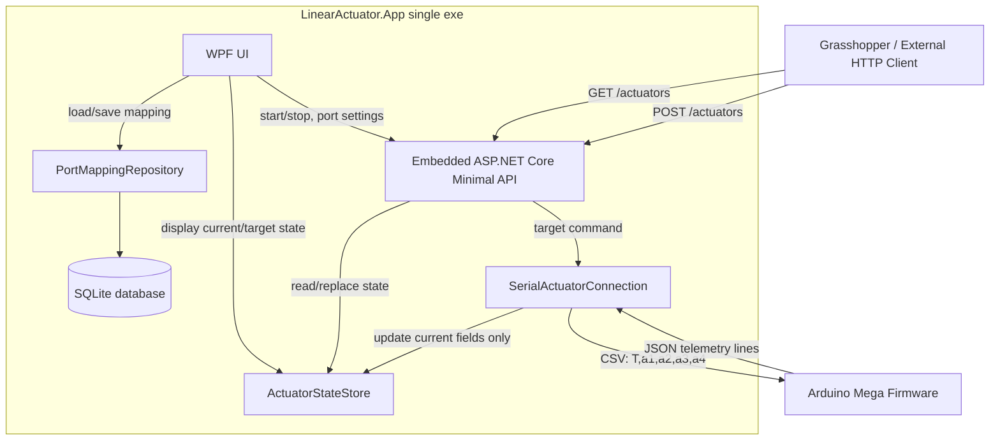

## Project Boundaries

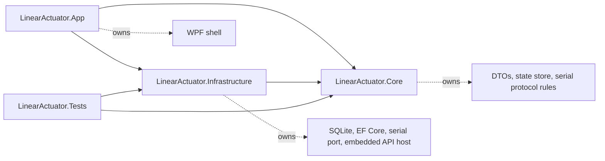

## API Request Flow

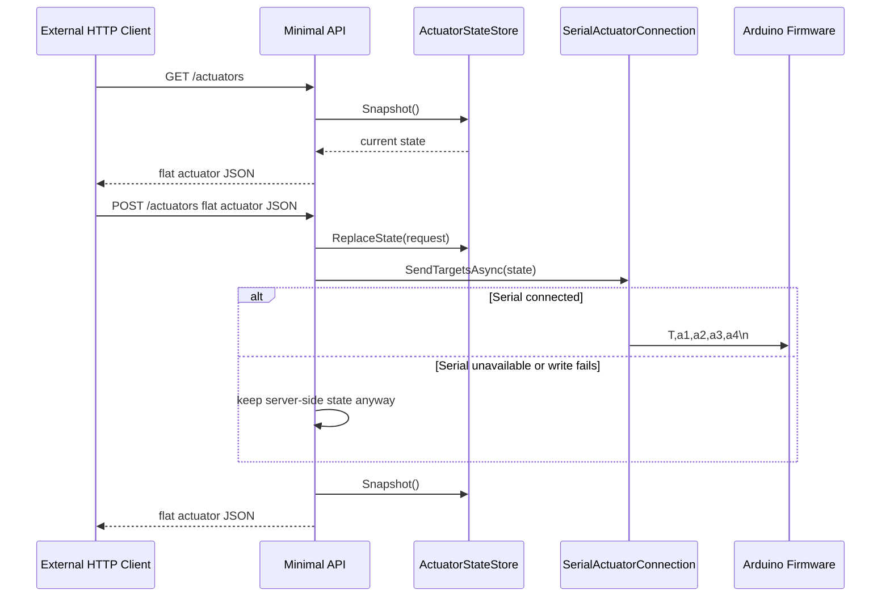

## Serial Telemetry Flow

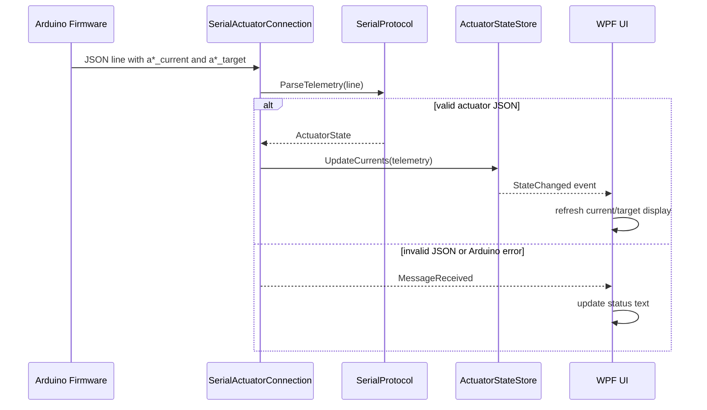

## SQLite Configuration Flow

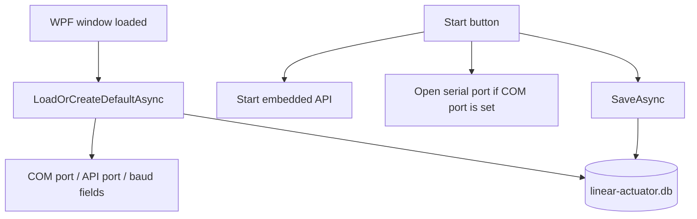

## Dataflow Diagrams

### Startup Dataflow

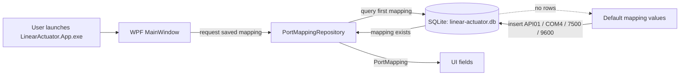

### Target Command Dataflow

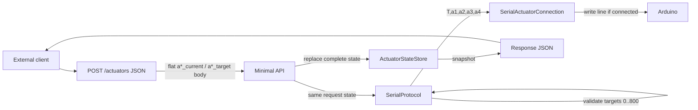

### Telemetry Dataflow

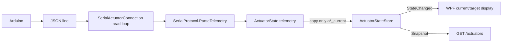

### Server-Authoritative Target Dataflow

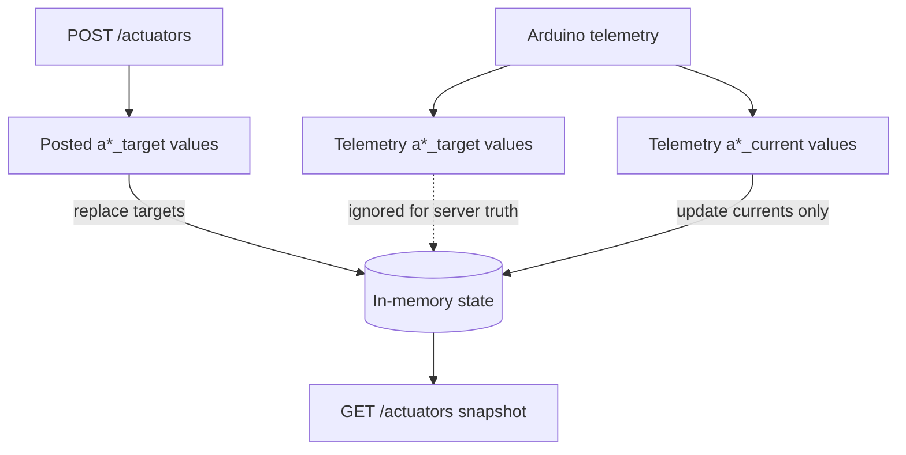

### Persistence Dataflow

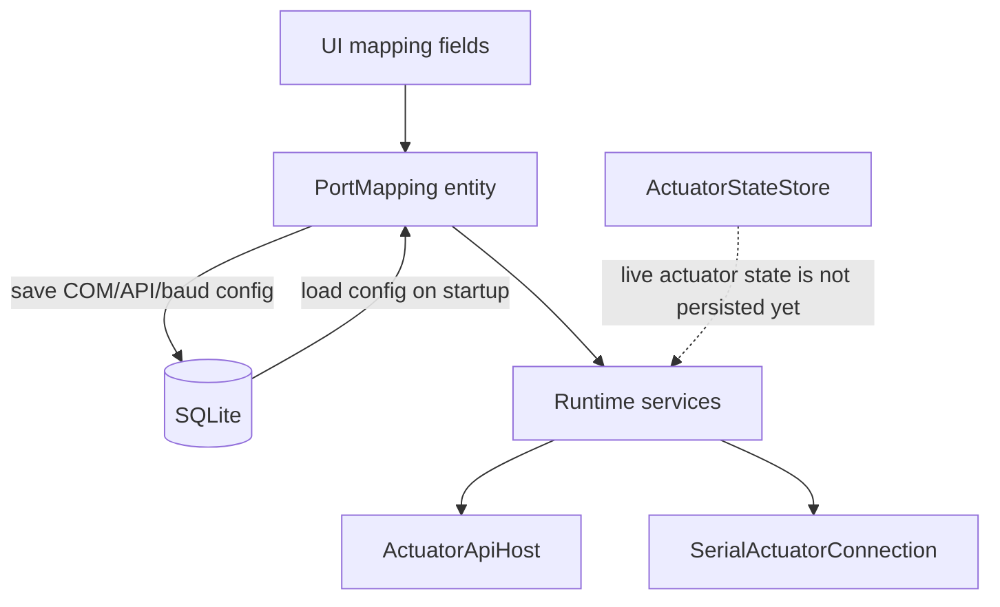

## Preserved Archive Contract

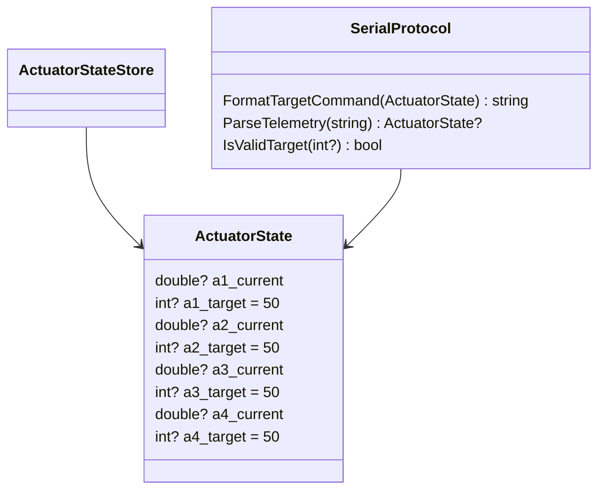

Key compatibility rules:

- HTTP JSON remains the flat four-actuator schema.
- Default target remains `50`.
- Target range remains `0..800`.
- Serial commands to Arduino are CSV, not JSON.
- Arduino telemetry updates only `*_current`; server targets remain authoritative.
