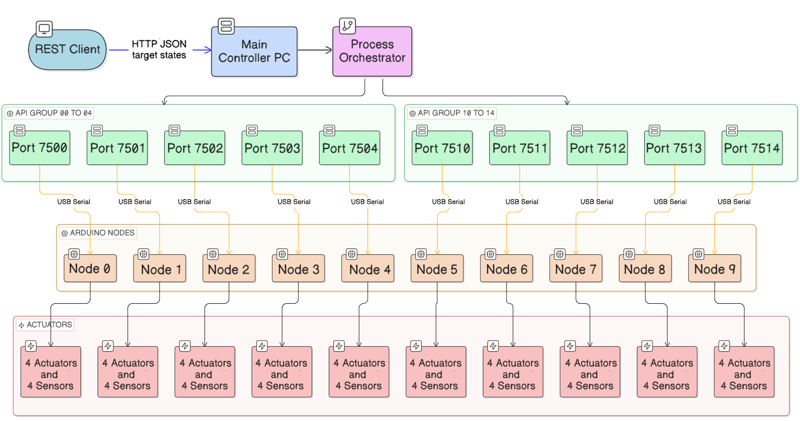
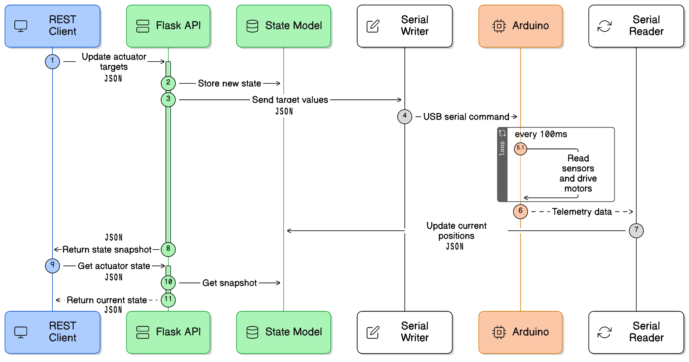

## Technical Implementation Description: Distributed Control of a 40-Linear-Actuator System

This section describes the implemented control architecture for an electro-mechanical system composed of 40 linear actuators and draw wire sensors.
This paper implements a modular system architecture as wiring this many components would exceed pin count and processing capacity of any standard microcontroller.
The coordinated 40-actuator system demands a distributed control architecture to manage scale, modularity , and responsiveness.
While modularity ensures scaling the actuation units reliably , it requires a centralized coordinator to orchestrate motion across all actuators.
The architecture distributes this responsibility: low-latency firmware-level control on each node ensures
deterministic motor response and sensor reads, while a series of REST API Python servers supervise the
status of the motion in real-time. This separation, real-time embedded loops decoupled from network-facing
command APIs, isolates each process, eliminates jitter from network delays and preserves tight feedback
timing on local sensor-to-actuator cycles. The control objective is deterministic target tracking in
the actuator sensor domain, with network-facing command and telemetry exchange exposed through REST
interfaces and node-facing real-time execution performed over USB serial links as follows.

1. REST API client implemented in Rhino and Grasshopper that issues GET requests to read current sensor values and POST requests to set linear actuator targets.
2. Python REST API server that receives requests on an **API port** and communicates with an Arduino Mega on a **serial USB COM port**
3. Arduino Mega reads 4 analogue input from the sensors and drives 4 linear actuators via separate H-Bridges

### Hardware Architecture and Specifications

The linear actuator hardware consists of  the following components:

- Total actuators/sensor pairs: 40
- Node count: 10
- Actuators per node: 4
- Node controller: Arduino Mega microcontroller (1 unit per node)
- Node-PC physical link: USB serial (1 serial link per node)
- Sensor per actuator: CWP-S1000v1 draw-wire potentiometer
- Linear actuator model: PLACEHOLDER_MODEL

Each Arduino Mega node uses one analog sensing channel and two PWM drive channels via an H-Bridge component per actuator:
Each actuator is driven towards a target length value (read from the sensor) until it is close enough to it. The closeness threshold is determined based
on the required accuracy and the existing noise in the sensor readings.

- Sensor channels: `A1`, `A2`, `A3`, `A4`
- Drive channels (forward/reverse half-bridge command):
  - Actuator 1: `RPWM=2`, `LPWM=3`
  - Actuator 2: `RPWM=4`, `LPWM=5`
  - Actuator 3: `RPWM=6`, `LPWM=7`
  - Actuator 4: `RPWM=8`, `LPWM=9`

### Host Port Mapping and Node Addressing

The main PC relies on a centralized configuration JSON file (port_map.json) to maintain a dynamic registry of all networked nodes. Each node in the system is uniquely identified by a dedicated API port and COM port pair. This mapping file serves as a critical lookup table that enables the main controller to:

- **Route API requests** to the correct node by resolving node identifiers to their respective API ports
- **Establish serial communication** by associating each node with its corresponding COM port for hardware-level control
- **Support scalability** by allowing new nodes to be added or existing nodes to be reconfigured without modifying the core controller logic
- **Provide flexibility** in node deployment, permitting nodes to be assigned different ports across different system configurations or environments

By externalizing this configuration into a JSON file rather than hardcoding port assignments, the system maintains loose coupling between the controller and individual nodes, facilitating easier maintenance, testing, and expansion of the multi-node architecture.
Table ## illustrates how each node is represented by a unique API port and COM port pair. The indices on the target shape shown in figure #A# illustrate the port mapping and the corresponding linear actuators. This mapping is loaded at launch time and validated for structural correctness and API port uniqueness. Figure #B# showcases the dataflow form a centralized control unit to each actuator group.

| Node Key | COM Port | API Port | Actuator Indices           |
| -------- | -------- | -------- | -------------------------- |
| API00    | COM17    | 7500     | 0:0:0, 0:0:1, 0:0:2, 0:0:3 |
| API01    | COM16    | 7501     | 0:1:0, 0:1:1, 0:1:2, 0:1:3 |
| API02    | COM15    | 7502     | 0:2:0, 0:2:1, 0:2:2, 0:2:3 |
| API03    | COM14    | 7503     | 0:3:0, 0:3:1, 0:3:2, 0:3:3 |
| API04    | COM13    | 7504     | 0:4:0, 0:4:1, 0:4:2, 0:4:3 |
| API10    | COM12    | 7510     | 1:0:0, 1:0:1, 1:0:2, 1:0:3 |
| API11    | COM11    | 7511     | 1:1:0, 1:1:1, 1:1:2, 1:1:3 |
| API12    | COM10    | 7512     | 1:2:0, 1:2:1, 1:2:2, 1:2:3 |
| API13    | COM9     | 7513     | 1:3:0, 1:3:1, 1:3:2, 1:3:3 |
| API14    | COM7     | 7514     | 1:4:0, 1:4:1, 1:4:2, 1:4:3 |

### Server Process Model and Concurrency Strategy

Each mapped API process is an independent Flask API application bound to one API port and one serial device. Within a node process, two execution contexts are used (Figure #C#).
Each of the Flask API applications acts as the source of truth bound to one API port and one serial device.
A thread-safe wrapper protects the shared state in memory using a lock. This ensures the API
and serial reader don't read or write at the same time, preventing data corruption. Within a node process, two execution contexts are used:
The multi-node runtime is established by a launcher that parses the mapping file, validates entries, and spawns one Python Flask API processes per mapping key.

1. API/Main thread: handles HTTP GET/POST requests and serial writes.
2. Serial reader thread: continuously reads telemetry lines from serial and updates only current fields in memory.
3. When the API receives a new target, it updates server state immediately.

