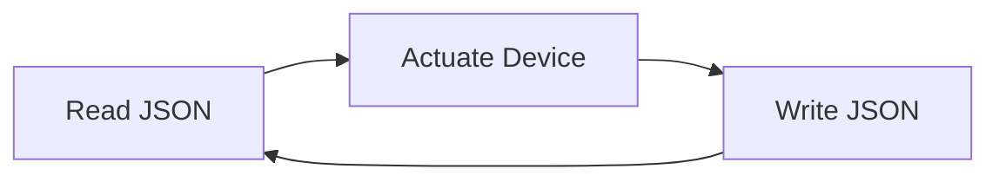

# Arduino Controller Server

## Purpose

Non-blocking read/write to serial port.

## Method and Rules

1. The read/write thread must be the same thread.
2. An in-memory model must maintain the data state.
3. The in-memory model will have multi-threaded read and writes.

## Runtime Flow

Thread 1: (in-memory model) main read/write ----- read-serial ---- read-model ---- write-serial ---- read ---- read ---- write ---- read ---
Thread 2: (read/write interface) secondary thread read ---- read ---- write-to-model ---- read-model ---- write-to-model

## Arduino Code Logic

ActuatorState Model definition on Setup
ActuatorState update and device actuation
Constant read, actuate, and write loop.

| Read (JSON)                          | Write (JSON)                               | Actuate        |
| ------------------------------------ | ------------------------------------------ | -------------- |
| get the target, save to status model | write sensor current value to status model | device control |

### Loop Design

