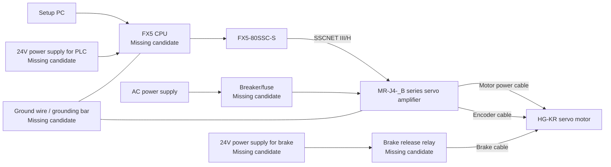

# Servo Motor Trial Run Configuration, Concise Version
## Purpose
Organize the parts currently available and the parts likely to be missing in order to actually run Mitsubishi Electric `HG-KR` series servo motors using `MR-J4-_B` series servo amplifiers and an `FX5-80SSC-S`.

## Main Parts Currently Available
| Category | Part |
| --- | --- |
| Servo motors | `HG-KR13BD`, `HG-KR43B`, `HG-KR73B` |
| Servo amplifiers | `MR-J4-70B`, `MR-J4-40B1`, `MR-J4W2-77B` |
| Motion module | `FX5-80SSC-S` |
| Motor power cable | `MR-PWS1CBL10M-A2-L` |
| Encoder cable | `MR-J3ENCBL10M-A2-L` |
| Brake cable | `MR-BKS1CBL10M-A2-L` |
| Communication cable | `MR-J3BUS1M` |
| PC connection cable | `MR-J3USBCBL3M` |
| Setup PC | ASUS `TUF Gaming F16 FX607JV` |

## Parts Likely to Be Missing
| Priority | Missing Candidate | Reason |
| --- | --- | --- |
| High | `FX5 CPU` main unit | The `FX5-80SSC-S` cannot be used by itself; it is used mounted to an FX5 series PLC CPU. |
| High | `24V DC power supply` for PLC | Control power is required for the PLC, I/O, relays, and related components. |
| High | Additional `SSCNET III/H` cables | If connecting multiple amplifiers, one `MR-J3BUS1M` cable is likely insufficient. |
| High | Breakers, fuses | Required to protect the servo amplifiers, PLC, and 24V circuits. |
| High | Ground wires, grounding bar | Required for grounding the servo amplifiers, PLC, and noise filter. |
| High | Terminal blocks, crimp terminals, wiring materials | Required for the actual wiring work. |
| High | 24V power supply for brake, brake release relay | Required to run motors with brakes, such as the `HG-KR13BD`. |
| Medium | Surge absorbers | Countermeasure against back EMF from brakes and relays. |
| Medium | Regenerative resistor or regenerative option | If a reducer or load is connected, measures against regenerative energy during deceleration may be required. |
| Medium | Battery for MR-J4 | May be required when using an absolute position system. |
| Medium | Operation switches | Useful for servo ON, reset, JOG, and stop operations. |

## Basic Configuration

## Key Points
- The `FX5-80SSC-S` alone cannot control the motors. An FX5 series PLC CPU such as an `FX5U` or `FX5UC` is required.
- `MR-J4-_B` series amplifiers are generally connected to the controller through SSCNET III/H.
- Motors with brakes, such as the `HG-KR13BD`, will not rotate without a 24V power supply for the brake and a brake release circuit.
- If there is only one `MR-J3BUS1M` cable, the communication cables may be insufficient for a multi-amplifier configuration.
- The `MR-J4-40B1` may have different power supply specifications from the other amplifiers, so confirm this in the technical documentation.
- For the first trial, it is easiest to remove reducers and gears and perform a low-speed JOG trial run with the motor alone.

## References
- [Mitsubishi Electric FA `MELSERVO-J4 Series`](https://www.mitsubishielectric.co.jp/fa/products/drv/servo/items/mr_j4/index.html)
- [Mitsubishi Electric FA `MELSERVO-J4 Compatible Rotary Servo Motor Features`](https://www.mitsubishielectric.co.jp/fa/products/drv/servo/pmerit/mr_j4/motor/feature.html)
- [Mitsubishi Electric FA `MELSERVO-J4 Servo Amplifier Concept`](https://www.mitsubishielectric.co.jp/fa/products/drv/servo/pmerit/mr_j4/amp/concept.html)
- [Mitsubishi Electric FA `Positioning Equipment | MELSEC-F Series`](https://www.mitsubishielectric.co.jp/fa/products/cnt/plc_fx/pmerit/contents/positioning/index.html)
- [Mitsubishi Electric FA `AC Servo MELSERVO Manual Download`](https://www.mitsubishielectric.co.jp/fa/download/search.do?mode=manual&kisyu=/servo)
