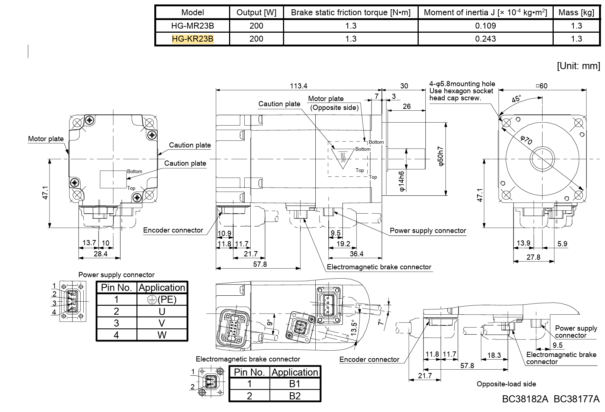
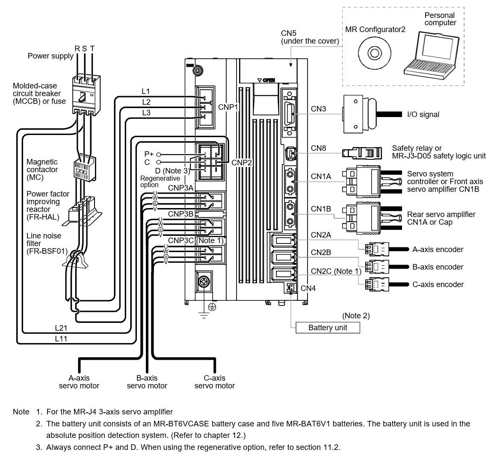
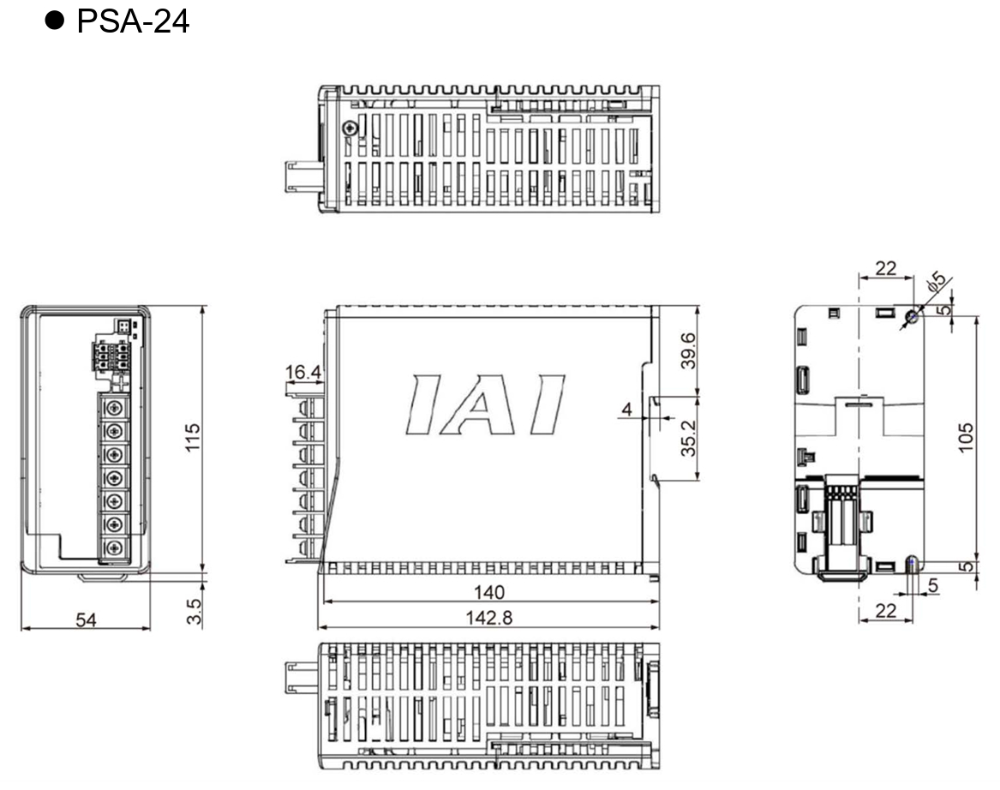
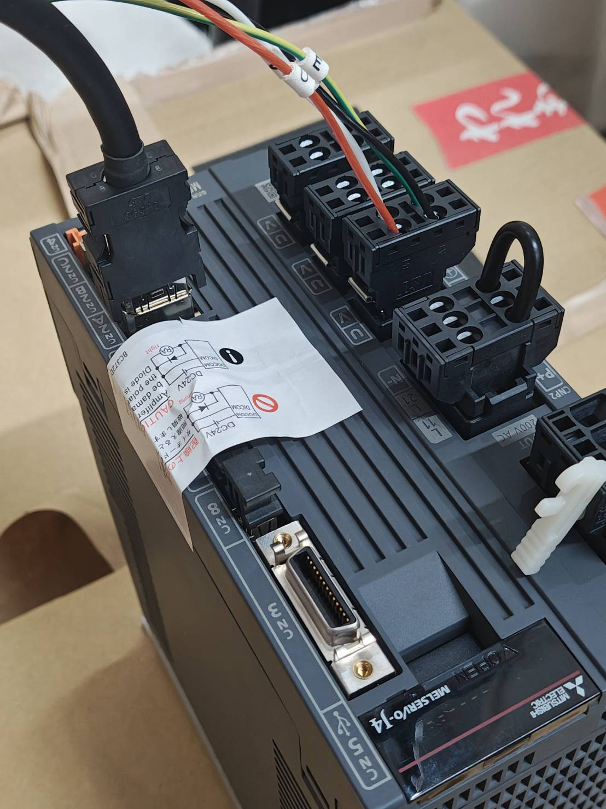

# Robot Motor Parts Assembly Test

Date: 2026/06/09
Duration: 3 hours

## Achievements

### Parts Found

#### Servo Motor:         - 

[HG-KR23B Manual](https://drive.google.com/file/d/1Mt98W8RFzZQjz6dGolFpmb6xz8s4VHXW/view?usp=drive_link)

#### Servo Amplifier 

[MR-J4W3-222B Manual](https://drive.google.com/file/d/1w_NnKrRrcZ_JV-ugFfeqebZD917cH_0O/view?usp=drive_link)

#### Power Supply

[Power Supply Manual](https://drive.google.com/file/d/1vlILnMQsAqkh5rC6sg_gk2drLDQHFEZL/view?usp=drive_link)

### Missing Parts

#### Motor Parts

1. Electromagnetic Brake Part (Connecting to the motor)

#### Amp Parts

1. Line Noise Filter (FR-BSF01)
2. Power factor improving reactor (FR-HAL)
3. Magnetic Contactor (MC)

### Wiring and Cable Connection Progess

1. Power Supply Input Wiring (100AC -> Plug)
2. Motor Power Supply Connector -> Servo Amp Power Supply Connection 1 (1/3)
    - Directly Compatible Cable Connection
3. Motor Encoder Connector -> Servo Amp Encoder Connection 1 (1/3)
    - 4 Wires (E-U-V-W) -> Amp JST Connector

> Note
> The White handle on the right buttom is the tool to open the connector pin holders

## TO DO

1. Confirm the missing parts against the purchase parts purchase list and see what is missing. 
2. Research How to control the Servo Amp with a computer
    - The Servo Amp has a Mini USB Port that can connect to a PC

