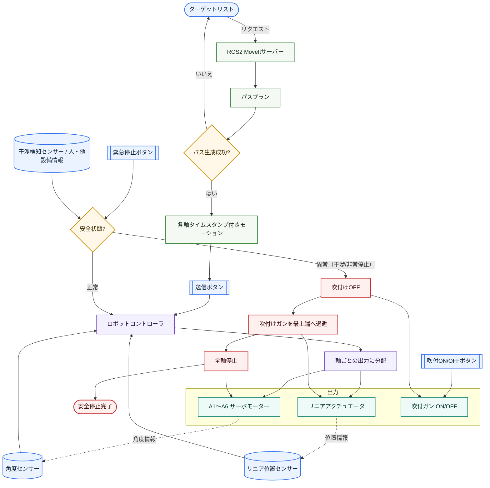

# Detailed Diagram

```mermaid
flowchart TD
    %% 入力
    T([ターゲットリスト])
    B_ON[[吹付ON/OFFボタン]]
    B_SEND[[送信ボタン]]
    B_STOP[[緊急停止ボタン]]
    S_ANG[(角度センサー)]
    S_LIN[(リニア位置センサー)]
    S_INT[(干渉検知センサー / 人・他設備情報)]

    %% 計画と実行
    M[ROS2 MoveItサーバー]
    P[パスプラン]
    OK{パス生成成功?}
    TS[各軸タイムスタンプ付きモーション]
    CTRL[ロボットコントローラ]
    SPLIT[軸ごとの出力に分配]

    %% 出力
    subgraph OUT[出力]
        AX[A1〜A6 サーボモーター]
        LIN[リニアアクチュエータ]
        GUN[吹付ガン ON/OFF]
    end

    %% 安全動作
    SAFE{安全状態?}
    S1[吹付けOFF]
    S2[吹付けガンを最上端へ退避]
    S3[全軸停止]
    SDONE([安全停止完了])

    %% メインフロー
    T -->|リクエスト| M --> P --> OK
    OK -->|はい| TS --> B_SEND --> CTRL --> SPLIT
    OK -->|いいえ| T

    SPLIT --> AX
    SPLIT --> LIN
    B_ON --> GUN

    %% フィードバック
    AX -.角度情報.-> S_ANG --> CTRL
    LIN -.位置情報.-> S_LIN --> CTRL

    %% 安全監視と異常時シーケンス
    B_STOP --> SAFE
    S_INT --> SAFE
    SAFE -->|正常| CTRL
    SAFE -->|異常（干渉/非常停止）| S1 --> GUN
    S1 --> S2 --> LIN
    S2 --> S3 --> AX
    S3 --> SDONE

    %% スタイル
    classDef input fill:#eaf3ff,stroke:#2f6feb,stroke-width:1.6px,color:#0b1f33;
    classDef plan fill:#f4f9f3,stroke:#2e7d32,stroke-width:1.4px,color:#102312;
    classDef decision fill:#fff8e8,stroke:#cc8b00,stroke-width:1.8px,color:#3a2a00;
    classDef ctrl fill:#f3f1ff,stroke:#6f42c1,stroke-width:1.4px,color:#24133d;
    classDef output fill:#eefaf7,stroke:#00796b,stroke-width:1.4px,color:#00312b;
    classDef safe fill:#fff0f0,stroke:#c62828,stroke-width:1.8px,color:#3a1010;

    class T,B_ON,B_SEND,B_STOP,S_ANG,S_LIN,S_INT input;
    class M,P,TS plan;
    class OK,SAFE decision;
    class CTRL,SPLIT ctrl;
    class AX,LIN,GUN output;
    class S1,S2,S3,SDONE safe;
```
