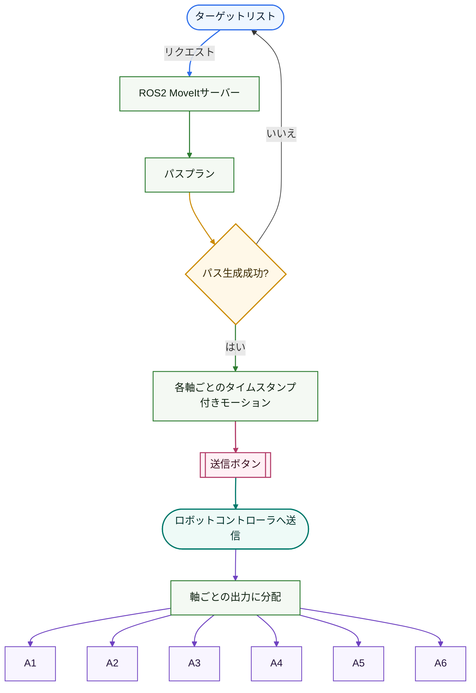

# Diagram

```mermaid
flowchart TD
    A([ターゲットリスト]) -->|リクエスト| B[ROS2 MoveItサーバー]
    B --> C[パスプラン]
    C --> D{パス生成成功?}
    D -->|はい| E[各軸ごとのタイムスタンプ付きモーション]
    E --> F[[送信ボタン]]
    F --> G([ロボットコントローラへ送信])
    G --> H[軸ごとの出力に分配]
    H --> A1[A1]
    H --> A2[A2]
    H --> A3[A3]
    H --> A4[A4]
    H --> A5[A5]
    H --> A6[A6]
    D -->|いいえ| A

    classDef source fill:#eef6ff,stroke:#2f6feb,stroke-width:1.6px,color:#0b1f33;
    classDef process fill:#f4f9f3,stroke:#2e7d32,stroke-width:1.4px,color:#102312;
    classDef decision fill:#fff8e8,stroke:#cc8b00,stroke-width:1.8px,color:#3a2a00;
    classDef action fill:#fff0f5,stroke:#b23a67,stroke-width:1.6px,color:#3a1020;
    classDef terminal fill:#eefaf7,stroke:#00796b,stroke-width:1.8px,color:#00312b;
    classDef axis fill:#f8f5ff,stroke:#6f42c1,stroke-width:1.2px,color:#24133d;

    class A source;
    class B,C,E,H process;
    class D decision;
    class F action;
    class G terminal;
    class A1,A2,A3,A4,A5,A6 axis;

    linkStyle 0 stroke:#2f6feb,stroke-width:1.8px;
    linkStyle 1 stroke:#2e7d32,stroke-width:1.6px;
    linkStyle 2 stroke:#cc8b00,stroke-width:1.6px;
    linkStyle 3 stroke:#2e7d32,stroke-width:1.6px;
    linkStyle 4 stroke:#b23a67,stroke-width:1.8px;
    linkStyle 5 stroke:#00796b,stroke-width:1.8px;
    linkStyle 6 stroke:#6f42c1,stroke-width:1.4px;
    linkStyle 7 stroke:#6f42c1,stroke-width:1.4px;
    linkStyle 8 stroke:#6f42c1,stroke-width:1.4px;
    linkStyle 9 stroke:#6f42c1,stroke-width:1.4px;
    linkStyle 10 stroke:#6f42c1,stroke-width:1.4px;
    linkStyle 11 stroke:#6f42c1,stroke-width:1.4px;
    linkStyle 12 stroke:#6f42c1,stroke-width:1.4px;
```
