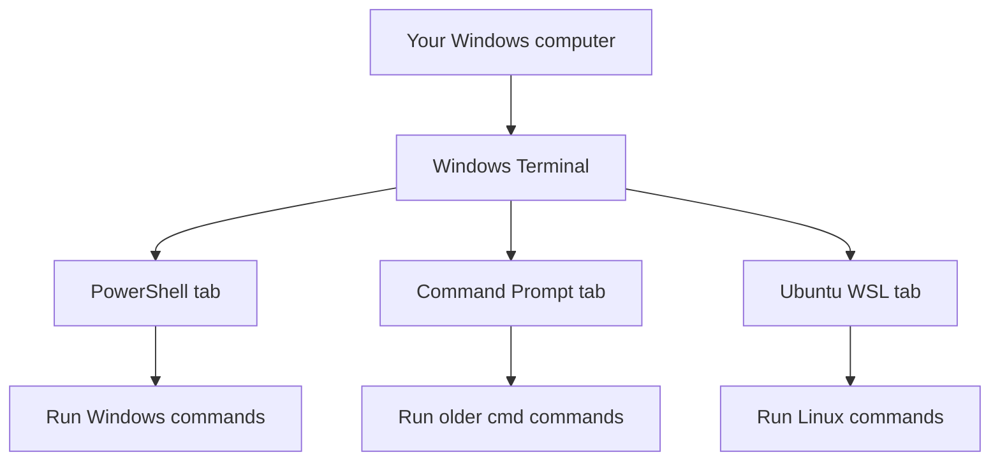

# Windows Terminal and PowerShell

From [[Robotics]]

This guide explains what a **terminal environment** is, what **PowerShell** is, and how to install **Windows Terminal** on Windows.

It is written for someone who is completely new to programming and command lines.

## What a Terminal Environment Is

A **terminal environment** is a text-based way to interact with your computer.

Instead of clicking buttons and menus, you type commands.

For example, in a terminal you might:

- move between folders
- create files
- install software
- run programs
- connect to servers
- build code

If a normal app feels like driving a car with buttons and touchscreens, a terminal feels more like talking directly to the engine.

## Why Terminals Exist

Computers used text commands long before modern graphical interfaces were common.

Even today, terminals are still important because they are:

- fast
- precise
- scriptable
- powerful
- widely used in programming, servers, and robotics

Many technical tools are designed to be used from a terminal first.

That is why you keep seeing instructions like:

```bash
sudo apt update
git clone <repo-url>
ros2 run demo_nodes_cpp talker
```

## What "Environment" Means Here

When people say **terminal environment**, they usually mean more than just the window.

It often includes:

- the terminal app itself
- the shell running inside it
- the current folder
- available commands
- installed tools
- environment variables

So the terminal environment is really the whole command-line setup you are working inside.

## What a Shell Is

A **shell** is the program that reads your commands and runs them.

Examples:

- **PowerShell** on Windows
- **Command Prompt** on Windows
- **bash** on Linux and WSL

The shell is the thing that understands what you type.

## What PowerShell Is

**PowerShell** is Microsoft's modern command-line shell.

It is more advanced than the old Windows Command Prompt.

PowerShell can:

- run commands
- manage files and folders
- automate tasks
- inspect the system
- run scripts

For a beginner, the simplest way to think about it is:

- **Command Prompt** is the older Windows text shell
- **PowerShell** is the more capable newer shell

## What Windows Terminal Is

**Windows Terminal** is an app made by Microsoft that gives you a nicer terminal window.

It is not the same thing as PowerShell.

This difference matters:

- **Windows Terminal** is the app window
- **PowerShell** is one shell you can run inside that window

Windows Terminal can also host:

- PowerShell
- Command Prompt
- Ubuntu on WSL
- Azure Cloud Shell
- other command-line profiles

## Simple Analogy

Think of it like this:

- **Windows Terminal** = the building
- **PowerShell** = one room inside the building
- **Ubuntu in WSL** = another room inside the building

The building gives you tabs, appearance settings, and window management.
The room is where the actual command interpreter lives.

## Why Windows Terminal Is Useful

Windows Terminal is helpful because it gives you:

- tabs
- multiple shells in one place
- better copy/paste
- better text rendering
- a cleaner interface
- easier switching between PowerShell and WSL

For robotics and developer work on Windows, that is very convenient.

## PowerShell vs Command Prompt vs WSL Ubuntu

These are easy to mix up, so here is the short version.

### PowerShell

- Windows shell
- good for Windows tasks and system management

### Command Prompt

- older Windows shell
- simpler and more limited

### WSL Ubuntu

- Linux environment running inside Windows
- used for Linux tools like ROS 2 and MoveIt

If you are doing Windows-specific tasks, PowerShell is often appropriate.
If you are following Ubuntu, ROS 2, or Linux tutorials, you usually want the WSL Ubuntu shell.

## Do You Need Windows Terminal to Use PowerShell?

No.

PowerShell can run in:

- the older PowerShell window
- Windows Terminal
- some editors like VS Code

But Windows Terminal is usually the nicer place to use it.

## How to Install Windows Terminal

There are a few ways, but the easiest method for most people is the Microsoft Store.

## Method 1: Install from Microsoft Store

### Step 1: Open the Microsoft Store

1. Click the **Start** button.
2. Search for **Microsoft Store**.
3. Open it.

### Step 2: Search for Windows Terminal

Search for:

```text
Windows Terminal
```

### Step 3: Install it

Click **Install** or **Get**.

Wait for the installation to finish.

### Step 4: Open it

After installation:

1. Click **Open** in the Store
2. or search for **Windows Terminal** in the Start menu

## Method 2: Install with `winget`

If you prefer commands, you can install it from PowerShell.

Open **PowerShell** and run:

```powershell
winget install --id Microsoft.WindowsTerminal -e
```

What this means:

- `winget` is the Windows package manager
- `install` means install an application
- `Microsoft.WindowsTerminal` is the package ID
- `-e` means exact match

## How to Open PowerShell

You can open PowerShell in several ways.

### Option 1: From Start menu

1. Click **Start**.
2. Type `PowerShell`.
3. Open **Windows PowerShell** or **PowerShell**.

### Option 2: Inside Windows Terminal

After installing Windows Terminal:

1. Open **Windows Terminal**.
2. It may open PowerShell by default.
3. If not, click the dropdown at the top and choose **PowerShell**.

## How to Check That Windows Terminal Is Installed

Open **Windows Terminal**.

If it opens and you can create a PowerShell tab, installation worked.

You can also check from PowerShell:

```powershell
wt
```

If the `wt` command opens Windows Terminal, that is a good sign.

## What You See When PowerShell Opens

A PowerShell prompt often looks something like this:

```powershell
PS C:\Users\YourName>
```

What that means:

- `PS` means PowerShell
- `C:\Users\YourName` is your current folder
- `>` means the shell is waiting for a command

## A Few Safe Beginner Commands to Try in PowerShell

```powershell
Get-Location
Get-ChildItem
Set-Location ~
mkdir test_folder
Remove-Item test_folder
```

What they do:

- `Get-Location`: show your current folder
- `Get-ChildItem`: list files and folders
- `Set-Location ~`: go to your home folder
- `mkdir test_folder`: create a folder
- `Remove-Item test_folder`: remove that folder

## Why This Matters for Robotics and Linux Work

If you are working through WSL, ROS 2, or MoveIt tutorials, you will often use **more than one terminal environment**:

- **PowerShell** for Windows commands
- **Ubuntu on WSL** for Linux commands

Windows Terminal makes it easier to keep both available in separate tabs.

For example:

- one tab can run PowerShell
- another tab can run Ubuntu 22.04 in WSL

That is especially useful when one tutorial tells you to run a Windows command and another tells you to run a Linux command.

## Example: Same Computer, Different Environments



## Common Beginner Questions

### "Is Windows Terminal the same as PowerShell?"

No.

Windows Terminal is the app window.
PowerShell is one shell that can run inside it.

### "Do I need Windows Terminal if I already have PowerShell?"

Not strictly, but Windows Terminal is usually better and more convenient.

### "Can Windows Terminal run Ubuntu too?"

Yes. If WSL is installed, Windows Terminal can open Ubuntu tabs.

### "Should I use PowerShell or Ubuntu for ROS 2?"

For the Ubuntu-based ROS 2 and MoveIt guides in this workspace, you usually want **Ubuntu on WSL**, not plain PowerShell.

### "Is typing commands dangerous?"

Commands can be powerful, but simple read-only or basic file commands are fine. The main thing is to understand what a command does before running it.

## Troubleshooting

### Microsoft Store is unavailable

Try the `winget` method:

```powershell
winget install --id Microsoft.WindowsTerminal -e
```

### `winget` is not recognized

Your Windows installation may be missing App Installer or may need updates.

### `wt` does not open Windows Terminal

Try opening Windows Terminal from the Start menu first. If needed, restart Windows after installation.

### PowerShell opens, but Ubuntu does not appear in Windows Terminal

That usually means WSL or Ubuntu is not installed yet.

## Summary

- a terminal environment is a text-based workspace for running commands
- PowerShell is a Windows shell
- Windows Terminal is a modern terminal app that can host multiple shells
- Windows Terminal is a very useful place to use both PowerShell and WSL Ubuntu

If you are preparing for Linux robotics work on Windows, this setup pairs very well with [[Installing WSL Ubuntu 22.04]].
