# Intro to Git Version Constrol

From [[Robotics]]

This is a simple introduction to **Git**, **GitHub**, and the main commands you will keep seeing in programming tutorials.

If you are completely new to programming, think of this as a practical guide to:

- what Git is
- why version control matters
- how GitHub fits in
- how to clone a repository
- what the main Git commands do

## What Git Is

**Git** is a tool that tracks changes to files over time.

It is most often used for:

- code
- notes
- configuration files
- documentation

You can think of Git like a very smart history system for a folder.

It helps you:

- see what changed
- save meaningful checkpoints
- go back to older versions
- work safely without losing progress
- collaborate with other people

## What Version Control Means

**Version control** means keeping a structured history of changes.

Without version control, people often do things like this:

- `project-final`
- `project-final-real`
- `project-final-real-v2`
- `project-final-real-v2-fixed`

That gets messy fast.

Git replaces that chaos with a proper timeline of changes.

Instead of copying folders over and over, you make a **commit**. A commit is a named snapshot of your work.

## Why Git Matters

Git matters because mistakes happen.

You might:

- break working code
- delete something important
- try an idea that does not work
- need to understand when a bug was introduced
- need to combine your work with someone else's work

Git makes all of that safer.

It gives you:

- history
- traceability
- backup through remotes like GitHub
- teamwork tools
- confidence to experiment

## What GitHub Is

**GitHub** is a website that hosts Git repositories online.

Git and GitHub are related, but they are not the same thing:

- **Git** is the version control tool
- **GitHub** is a hosting platform built around Git

People use GitHub to:

- store repositories online
- share code
- collaborate with teams
- review changes
- publish open-source projects

## What a Repository Is

A **repository** or **repo** is a project folder that Git tracks.

A repo contains:

- files
- folders
- Git history
- branches
- commits

## What `.gitignore` Is

Not every file in a project should be committed to Git.

Some files are:

- temporary
- generated automatically
- specific to your computer
- private or secret
- too large or noisy to keep in version history

That is what `.gitignore` is for.

A `.gitignore` file tells Git which files and folders it should **ignore by default**.

Common examples:

- build output
- cache folders
- log files
- Python `__pycache__`
- `node_modules`
- `.env` files with secrets

Example:

```gitignore
# Ignore Python cache files
__pycache__/

# Ignore log files
*.log

# Ignore environment files
.env

# Ignore a build folder
build/
```

### Why `.gitignore` matters

It keeps your repository cleaner and safer.

Without it, beginners often accidentally commit:

- huge generated folders
- machine-specific settings
- secret tokens and passwords
- files that change constantly and clutter history

## Ignore Rules and Inclusion Rules

Git ignore files are really pattern rules.

Most rules are **ignore rules**, which tell Git what to skip.

Examples:

- `*.log` means ignore every file ending in `.log`
- `build/` means ignore the whole `build` folder
- `.env` means ignore a file named `.env`

You can also write **inclusion rules** using `!`.

An inclusion rule says, "even though something matching this pattern was ignored, include this specific file or path again."

Example:

```gitignore
# Ignore all log files
*.log

# But keep this one important example log
!example.log

# Ignore everything in docs/generated
docs/generated/*

# But include this one file again
!docs/generated/keep-this.md
```

### Simple way to think about it

- normal pattern: "ignore this"
- pattern starting with `!`: "actually, include this one again"

This is useful when:

- you want to ignore a whole folder except one sample file
- you want to ignore many generated files but keep one template
- you want broad rules with a few exceptions

## `.gitignore` Does Not Remove Already Tracked Files

This is an important beginner gotcha.

If a file was already committed before you add it to `.gitignore`, Git may continue tracking it.

So `.gitignore` mainly affects **untracked files** and files that have not already been added to history.

## How Files Get Included in Git

A file usually becomes part of Git when you stage and commit it.

Typical flow:

- create or change a file
- run `git add <file>`
- run `git commit`

If a file is ignored by `.gitignore`, Git normally leaves it alone.

If you intentionally want to track a file that is not ignored, you add it with `git add`.

If you are using an ignore file with `!` rules, those inclusion rules can make selected files trackable again.

## Example of Ignore vs Include

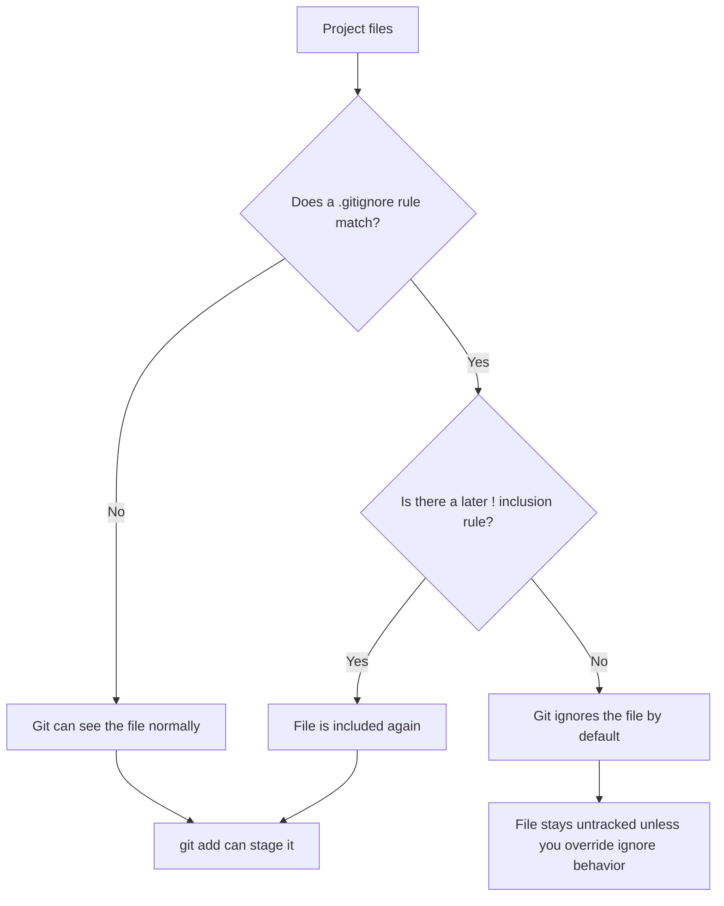

## Simple Mental Model

This is a good beginner model:

- your files live in a folder
- Git watches changes in that folder
- you choose what to save with `git add`
- you save a checkpoint with `git commit`
- GitHub is the online copy of that repository
- `git push` sends your commits to GitHub
- `git pull` brings changes from GitHub down to your machine

## How to Clone a Repository from GitHub

**Cloning** means making a local copy of an online repository.

### Step 1: Go to the GitHub repository page

Example:

```text
https://github.com/owner/repo-name
```

### Step 2: Copy the repository URL

On GitHub:

1. Click the green **Code** button.
2. Copy the HTTPS URL.

It usually looks like this:

```text
https://github.com/owner/repo-name.git
```

### Step 3: Open a terminal

This could be:

- Ubuntu on WSL
- Windows PowerShell
- Git Bash
- a Linux terminal

### Step 4: Move to the folder where you want the repo

Example:

```bash
cd ~
```

### Step 5: Run `git clone`

```bash
git clone https://github.com/owner/repo-name.git
```

### Step 6: Enter the cloned repository

```bash
cd repo-name
```

Now you have a local copy of that project on your computer.

## First-Time Setup Note

If `git` is not installed, you may need to install it first.

On Ubuntu:

```bash
sudo apt update
sudo apt install -y git
```

Check it with:

```bash
git --version
```

## Main Git Areas to Understand

Git is easier if you know these three ideas:

- **working directory**: your current files
- **staging area**: the changes you are preparing for the next commit
- **repository history**: the commits already saved in Git

You can picture the normal flow like this:

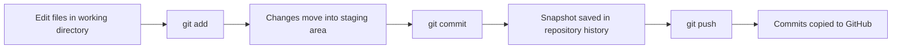

## `git init`

Creates a new Git repository in the current folder.

Use it when you have a normal folder and want Git to start tracking it.

```bash
git init
```

### What it does

- creates Git metadata in the folder
- turns the folder into a repository
- does not automatically save your files yet

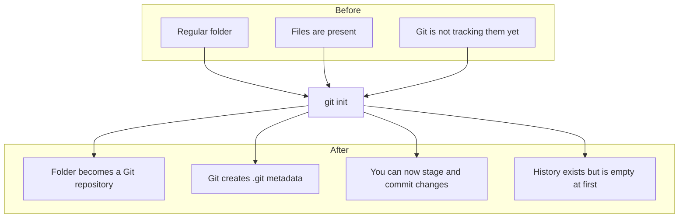

## `git add`

Moves file changes into the staging area so they are ready to be committed.

```bash
git add file.txt
git add .
```

### What it does

- selects changes for the next commit
- does not create a commit yet
- lets you control what gets saved

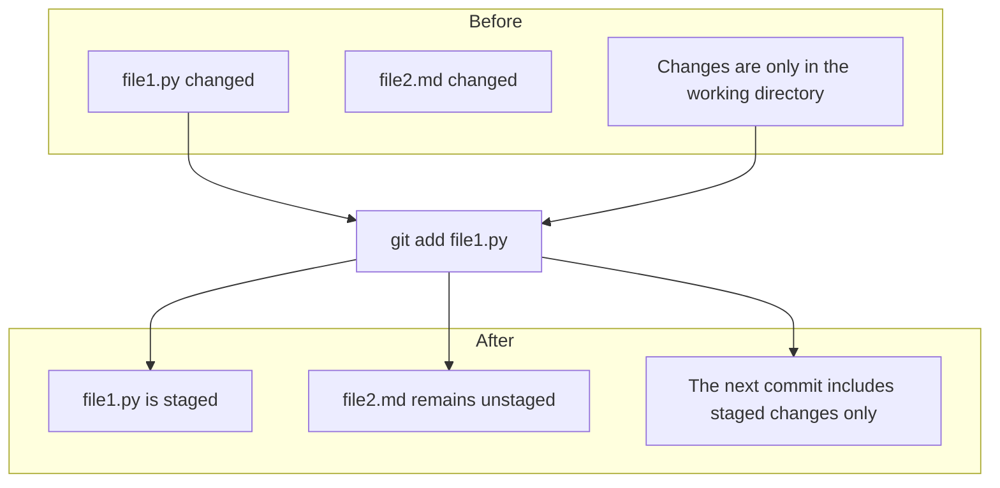

## `git commit`

Creates a saved snapshot of the staged changes.

```bash
git commit -m "Add setup guide"
```

### What it does

- saves the staged changes into Git history
- creates a checkpoint with a message
- lets you return to that state later

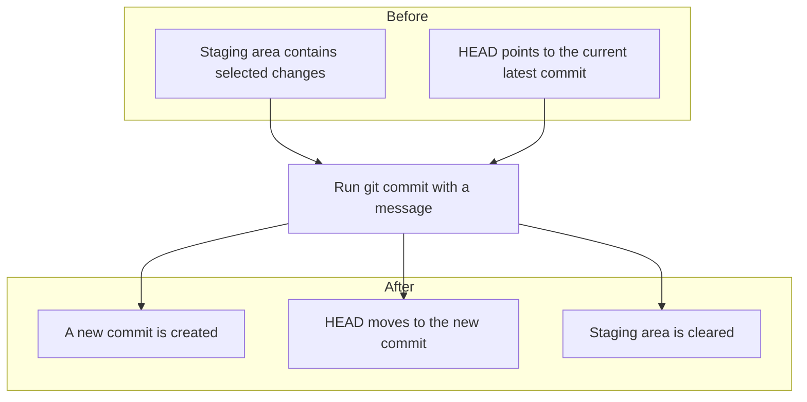

## `git pull`

Downloads changes from the remote repository and updates your local branch.

```bash
git pull
```

### What it does

- gets newer commits from GitHub
- combines them into your current branch
- is commonly used before starting work or before pushing

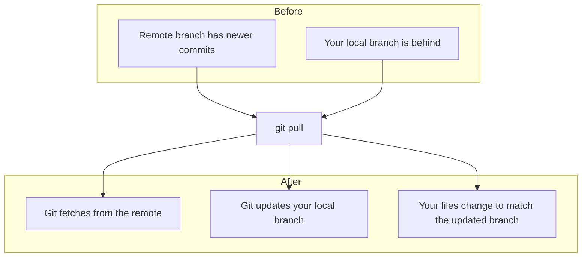

## `git push`

Uploads your local commits to the remote repository, such as GitHub.

```bash
git push
```

### What it does

- sends your committed work to GitHub
- shares your work with others
- does not send uncommitted changes

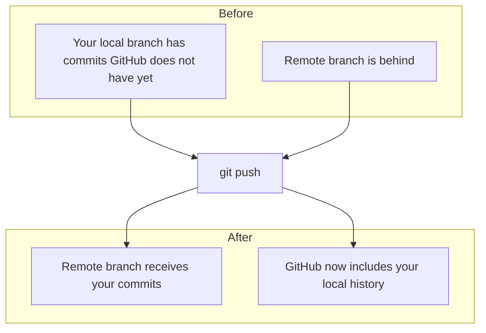

## `git switch`

Moves you from one branch to another.

```bash
git switch main
```

### What it does

- changes your current branch
- updates your working files to match that branch

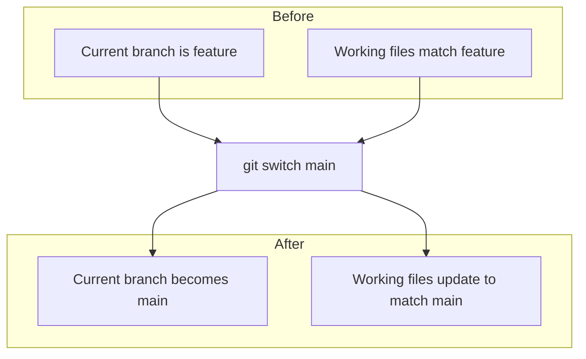

## `git switch -c`

Creates a new branch and switches to it immediately.

```bash
git switch -c new-feature
```

### What it does

- makes a new branch
- moves you onto that branch right away
- is a safe way to work on something without disturbing `main`

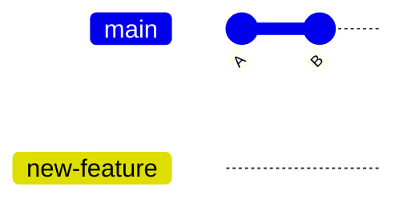

At that moment, both `main` and `new-feature` point to the same latest commit. The difference is that new work from here can go onto `new-feature` without changing `main`.

## `git merge`

Combines changes from one branch into another.

Example:

```bash
git switch main
git merge new-feature
```

### What it does

- takes commits from one branch and integrates them into another
- often used when finishing a feature branch
- may create a merge commit

### The important idea

`git merge` usually **preserves the branch structure**. It says, "bring that branch into this branch," and Git may create a merge commit to connect the two histories.

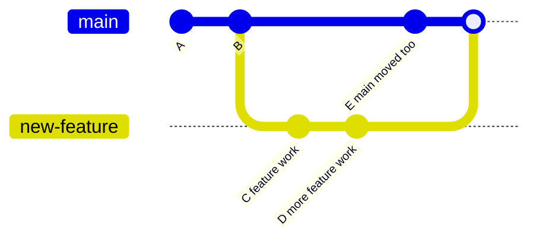

After the merge, `main` contains both lines of work, and the graph still shows that the feature branch existed separately.

## `git rebase`

Replays commits from one branch on top of another base.

Example:

```bash
git switch new-feature
git rebase main
```

### What it does

- takes your branch commits and replays them one by one on top of a newer base
- creates a cleaner, more linear history
- rewrites commit history, so use it carefully

### The important idea

`git rebase` does **not** combine histories the way merge does. Instead, it takes the commits from your branch and rebuilds them as new commits on top of the target branch.

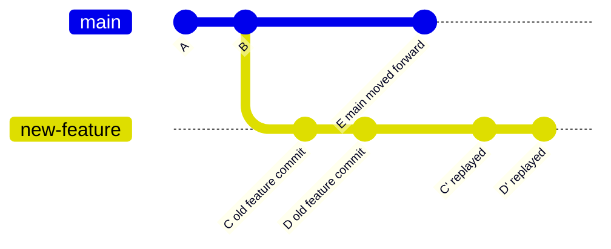

After the rebase, the old branch commits are replaced by new versions. The branch now looks like it started after `E`.

## Merge vs Rebase

This is the simplest distinction:

- `merge` combines branches while keeping the branch shape visible
- `rebase` moves one branch onto a newer base by rewriting that branch's commits

### Merge keeps the shape

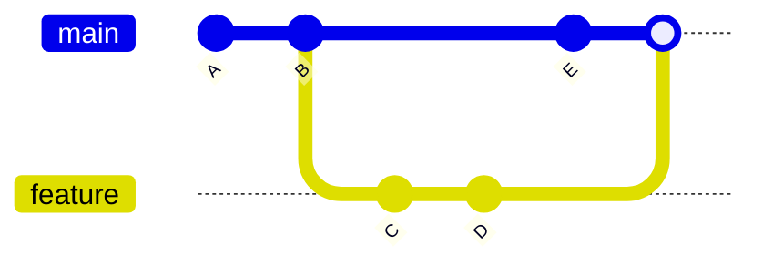

### Rebase rewrites the branch

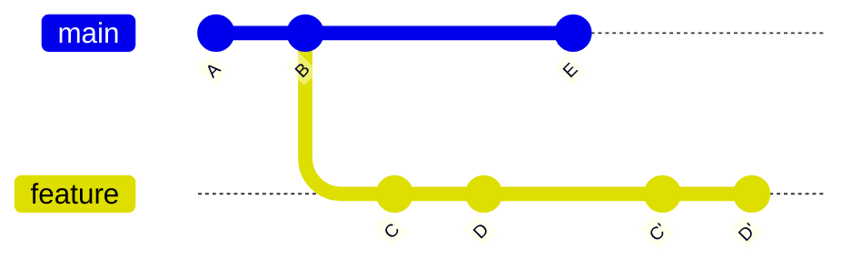

Simple rule:

- if you want to **combine two branches**, think `merge`
- if you want to **move your branch onto the latest main**, think `rebase`

## `git cherry-pick`

Copies one specific commit onto your current branch.

```bash
git cherry-pick abc1234
```

### What it does

- takes one chosen commit
- applies it to the branch you are on
- is useful when you want one fix but not a whole branch

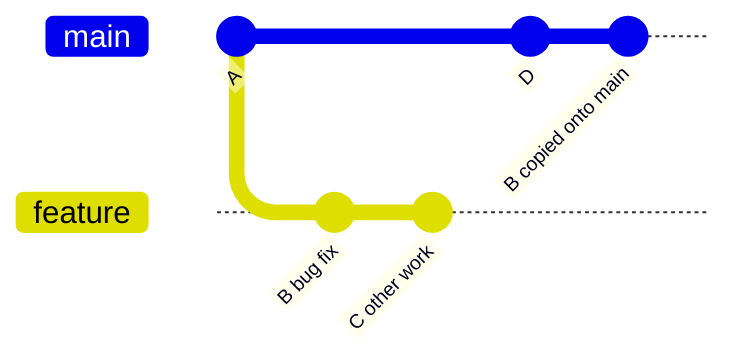

## `git restore`

Restores files in your working directory or unstages changes, depending on how you use it.

Examples:

```bash
git restore file.txt
git restore --staged file.txt
```

### What it does

- discards uncommitted changes in files
- or removes files from the staging area
- helps undo mistakes before commit

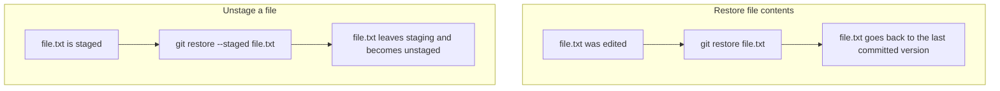

## `git reset`

Moves `HEAD` and can also change the staging area and working files depending on the mode.

This is a powerful command, so it matters to understand the variants.

## `git reset --soft`

Moves the branch pointer backward but keeps your changes staged.

```bash
git reset --soft HEAD~1
```

### What it does

- removes the latest commit from history
- keeps the file changes
- keeps them staged for a new commit

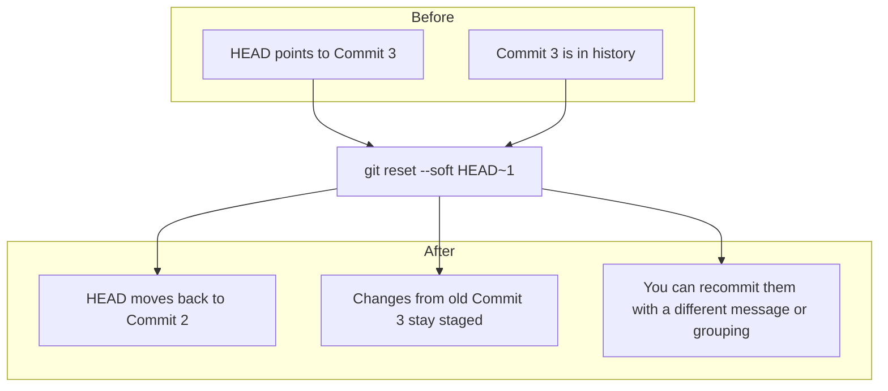

## `git reset --hard`

Moves the branch pointer backward and throws away staged and working changes to match that target exactly.

```bash
git reset --hard HEAD~1
```

### What it does

- removes commits from your current branch position
- discards staged changes
- discards working directory changes
- can permanently delete work you have not backed up

Use this very carefully.

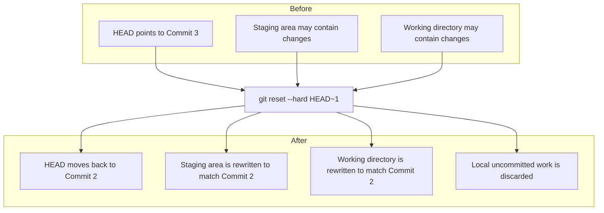

## Common Beginner Workflow

This is a very typical simple flow:

```bash
git clone https://github.com/owner/repo-name.git
cd repo-name
git switch -c my-change
# edit files
git add .
git commit -m "Describe the change"
git push
```

## A Simple Story Version of Git

If you want the shortest mental model:

- `git init`: start Git in a folder
- `git clone`: copy a repo from GitHub
- `git switch -c`: make a branch for your work
- `git add`: prepare changes
- `git commit`: save a checkpoint
- `git pull`: bring down remote updates
- `git push`: send your commits to GitHub
- `git merge`: combine branches
- `git rebase`: replay your branch on a newer base
- `git cherry-pick`: copy one commit
- `git restore`: undo file changes or unstage them
- `git reset --soft`: undo a commit but keep changes staged
- `git reset --hard`: force everything back to an older state

## Important Safety Note

Some Git commands are very safe, and some can destroy uncommitted work.

Usually safe for beginners:

- `git status`
- `git add`
- `git commit`
- `git switch`
- `git pull`
- `git push`

Commands to use more carefully:

- `git rebase`
- `git restore`
- `git reset --hard`

## One Command You Should Learn Immediately

Even though it was not in the main list, this is one of the most useful commands in Git:

```bash
git status
```

It tells you:

- which branch you are on
- what files changed
- what is staged
- what is not staged

When in doubt, run `git status`.

## Final Idea

Git is not just a tool for experts. It is a safety system for your work.

It helps beginners because it gives structure, history, and a way to recover from mistakes.

Once you get used to a few commands, it becomes one of the most useful tools in programming.
