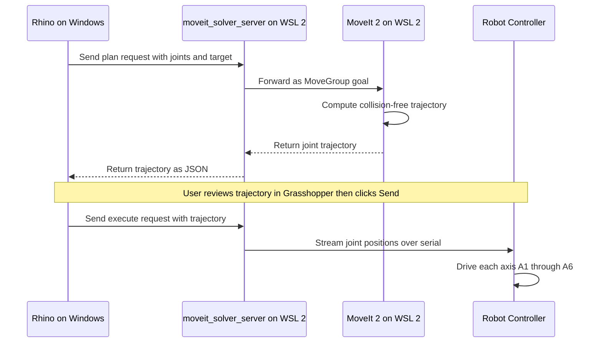
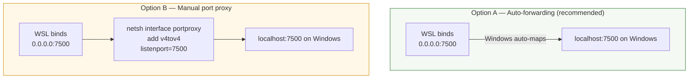
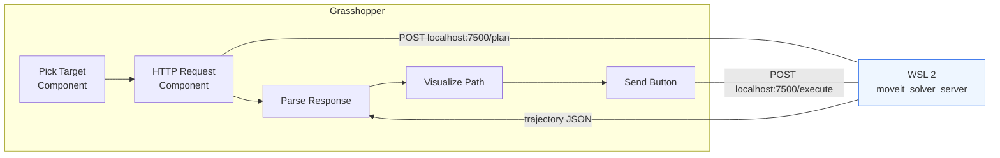
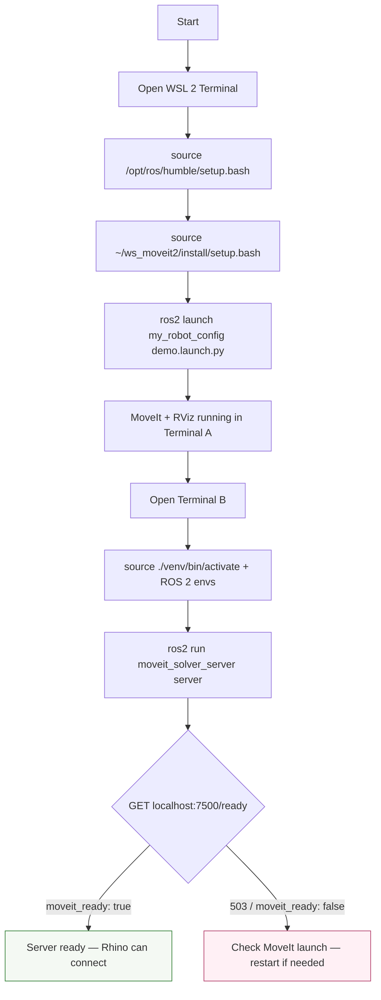

# Running ROS2 / MoveIt in WSL2

## Why WSL2

**ROS 2 Humble** and **MoveIt 2** only run natively on Linux (Ubuntu 22.04).
Since our primary development machine is Windows, we run a **WSL 2 Ubuntu 22.04** instance as the Linux backend.
Rhino (and any other Windows client) communicates with the robot server over HTTP through WSL2's networking.

## Key Components

| Component | Role | Where it runs |
|---|---|---|
| **MoveIt 2** | Motion planning engine — takes a target pose, computes collision-free joint trajectories. | WSL 2 (Ubuntu 22.04) |
| **ROS 2 Humble** | Middleware that MoveIt 2 is built on; manages nodes, topics, actions, and DDS communication. | WSL 2 (Ubuntu 22.04) |
| **moveit_solver_server** | FastAPI HTTP bridge that exposes `/plan` and `/execute` endpoints. Translates HTTP requests into ROS 2 / MoveIt actions. | WSL 2 (Ubuntu 22.04) |
| **Rhino / Grasshopper** | CAD environment where users pick target poses and request paths. Acts as an HTTP client. | Windows (host) |

## Architecture Overview

```mermaid
flowchart LR
    subgraph Windows["Windows Host"]
        Rhino[Rhino / Grasshopper\nHTTP Client]
    end

    subgraph WSL["WSL 2 — Ubuntu 22.04"]
        Server[moveit_solver_server\nFastAPI :7500]
        MoveIt[MoveIt 2\nMoveGroup Action]
        RViz[RViz 2\nVisualization]
    end

    subgraph Robot["Physical Robot"]
        Controller[Robot Controller\n(Arduino / custom)]
        Axes[A1 – A6 Axes]
    end

    Rhino -- "HTTP POST /plan" --> Server
    Server -- "ROS 2 Action (MoveGroup)" --> MoveIt
    MoveIt -- "joint trajectory" --> Server
    Server -- "JSON response" --> Rhino
    MoveIt -.-> RViz
    Rhino -- "HTTP POST /execute" --> Server
    Server -- "trajectory topic" --> Controller
    Controller --> Axes
```

## Path Planning Request Flow



## WSL 2 Networking

WSL 2 uses a lightweight Hyper-V virtual network. By default, ports opened inside WSL 2 are **not automatically accessible** from the Windows host. We handle this in one of two ways:



**Option A** works on recent Windows 11 builds (22H2+) where WSL 2 automatically forwards `localhost` ports.

**Option B** is the fallback for older builds or if auto-forwarding fails:

```powershell
# Run in an elevated Windows PowerShell
netsh interface portproxy add v4tov4 listenport=7500 listenaddress=0.0.0.0 connectport=7500 connectaddress=$(wsl hostname -I | ForEach-Object { $_.Trim() })
```

## Rhino / Grasshopper Integration

From Grasshopper, the workflow is straightforward — an HTTP request to `localhost:7500` reaches the FastAPI server inside WSL 2.



A typical Grasshopper `GH SendingHTTPRequest` or Python `requests.post` call:

```python
import requests

response = requests.post("http://localhost:7500/plan", json={
    "joints": [0.0, 0.0, 0.0, 0.0, 0.0, 0.0],   # current joint positions (rad)
    "target": [0.5, -0.3, 0.4, 0.0, 1.57, 0.0],   # target joint positions (rad)
})
trajectory = response.json()["trajectory"]
```

## Startup Checklist



## Troubleshooting

| Symptom | Cause | Fix |
|---|---|---|
| `Connection refused` from Rhino | WSL 2 port not forwarded to Windows | Use Option B port proxy, or update to Windows 11 22H2+ |
| `/ready` returns `moveit_ready: false` | MoveIt 2 not launched or crashed | Restart the MoveIt demo launch in Terminal A, then restart the server |
| Plan succeeds but robot doesn't move | `/execute` endpoint not called | Make sure Grasshopper sends a second `POST /execute` after reviewing the trajectory |
| `localhost` resolves to IPv6 `::1` | Windows DNS quirk | Use `127.0.0.1` explicitly in Grasshopper HTTP requests |
